Software Architecture Document (SAD)
====================================

SmartDeviceLink 
---------------

Table of Contents
=================

-   [1. Introduction](#1. Introduction)

    -   [1.1. Purpose and Scope of the SAD](#1.1. Purpose and Scope of the SAD)

    -   [1.2. Definitions and Abbreviations](#1.2. Definitions and Abbreviations)

    -   [1.3. Document Roadmap](#1.3. Document Roadmap)

-   [2.  Case Background](#2.  Case Background)

    -   [2.1. System Context, Mission and Scope](#2.1. System Context, Mission and Scope)

    -   [2.2. Significant Driving Requirements](#2.2. Significant Driving Requirements)

-   [3.  Solution Overview](#3.  Solution Overview)

-   [4.  Views](#4.  Views)

    -   [4.1. Components View](#4.1. Components View)

    -   [4.2. Component Interaction View](#4.2. Component Interaction View)

        -   [4.2.1. Transport layer](#4.2.1. Transport layer)

        -   [4.2.2. Protocol layer](#4.2.2. Protocol layer)

        -   [4.2.3. Business layer](#4.2.3. Business layer)

    -   [4.3. User Interface](#4.3. User Interface)

    -   [4.4. Data View](#4.4. Data View)

    -   [4.5. Process State View](#4.5. Process State View)

    -   [4.6. Process View](#4.6. Process View)

    -   [4.7. Development View](#4.7. Development View)

        -   [4.7.1. Implementation Technologies](#4.7.1. Implementation Technologies)

        -   [4.7.2. Modules and Code Base Organization](#4.7.2. Modules and Code Base Organization)

        -   [4.7.3. Development Environment and Standards](#4.7.3. Development Environment and Standards)

    -   [4.8. Deployment View](#4.8. Deployment View)

    -   [4.9. Operational View](#4.9. Operational View)

-   [5.  View-to-View Relations](#5.  View-to-View Relations)

    -   [5.1. Component-to-Layer](#5.1. Component-to-Layer)

    -   [5.2. Data-to-Layer View](#5.2. Data-to-Layer View)

-   [6.  Solution Background](#6.  Solution Background)

    -   [6.1. Architecture Design Approach](#6.1. Architecture Design Approach)

    -   [6.2. Requirements Coverage](#6.2. Requirements Coverage)

    -   [6.3. Prototyping Results](#6.3. Prototyping Results)

    -   [6.4. Open Questions and Known Issues](#6.4. Open Questions and Known Issues)

    -   [6.5. Results Analysis](#6.5. Results Analysis)

-   [7.  References](#7.  References)

-   [8.  List of Figures](#8.  List of Figures)

-   [9.  Appendices](#9.  Appendices)

1. Introduction
===============

1.1. Purpose and Scope of the SAD
------------------------------------------------------------------

This document defines the high-level software architecture for the SmartDeviceLink (SDL) system. It describes the structure and the main components of the system, the project basis and dependencies. The goal of the document is to describe, in sufficient detail, the software components, their responsibilities, behavior, and interfaces. This document provides support for developers and others to learn system design, limitations, stakeholders, and ways of extension and further development.

1.2. Definitions and Abbreviations
----------------------------------

Abbreviations used in this document please find in the table below.

| **Abbreviation** | **Expansion**                    |
|------------------|----------------------------------|
| BT               | Bluetooth                        |
| GUI              | Graphical User Interface         |
| HMI              | Human Machine Interface          |
| IVI              | In-Vehicle Infotainment          |
| RPC              | Remote Procedure Call            |
| SDE              | Software Development Environment |
| SDL              | SmartDeviceLink                  |
| SEE              | Software Engineering Environment |
| TTS              | Text To Speech                   |
| VR               | Voice Recognition                |

Definitions used in this document are in the table below.

| **Definition** | **Description**                                                                                                                                                                                            |
|----------------|------------------------------------------------------------------------------------------------------------------------------------------------------------------------------------------------------------|
| Concern        | A functional or non-functional requirement.                                                                                                                                                                |
| Model          | A particular diagram or description constructed following the method defined in a viewpoint. These provide the specific description of the system, which can include identifiable subsystems and elements. |
| Stakeholder    | An individual, group or organization that has at least one concern relating to the system.                                                                                                                 |

1.3. Document Roadmap
---------------------

The SW architecture of system is considered from different viewpoints:

| **Viewpoint**         | **Viewpoint Description**                                                                                                                                                                                                                                                                                                                                                                                                                                                                                                                 |
|-----------------------|-------------------------------------------------------------------------------------------------------------------------------------------------------------------------------------------------------------------------------------------------------------------------------------------------------------------------------------------------------------------------------------------------------------------------------------------------------------------------------------------------------------------------------------------|
| Component             | Functional type of view which describes the system's runtime functional elements and their responsibilities.                                                                                                                                                                                                                                                                                                                                                                                                                              |
| Component Interaction | Functional type of view which describes interactions of the system's functional elements. Component Interaction view uses component-level sequence or collaboration diagrams to show how specific components will interact. The purpose is to validate structural design via exploration of the software dynamics.                                                                                                                                                                                                                        |
| Use Case              | Use Case View captures system functionality as it is seen by users. System behavior, that is what functionality it must provide, is documented in a use case model.                                                                                                                                                                                                                                                                                                                                                                       |
| User Interface        | Functional type of view which describes interfaces of the system's functional elements.                                                                                                                                                                                                                                                                                                                                                                                                                                                   |
| Data                  | Describes the way that the system stores, manipulates, manages, and distributes information. The ultimate purpose of virtually any computer system is to manipulate information in some form, and this viewpoint develops a complete but high-level view of static data structure and information flow. The objective of this analysis is to answer the questions around data content, structure, ownership, quality, consistency update latency, references, volumes, aging, retention, and migration.                                   |
| Process State         | Concurrency type of view. Process State View is used to model standard process dynamics that are independent of the loaded components. These dynamics may, for example, be part of a component management infrastructure that loads and controls components in the process. For process dynamics, it is often useful to think in terms of a standard set of states such as initializing, operating, and shutting down                                                                                                                     |
| Process               | Concurrency type of view. Process View describes processes and process inter-communication mechanisms independent of physical hardware deployment                                                                                                                                                                                                                                                                                                                                                                                         |
| Development           | Describes the architecture that supports the software development Process. This view addresses the specific concerns of the software developers and testers, namely code structure and dependencies, build and configuration management of deliverables, design constraints and patterns, and naming standards, etc. The importance of this view depends on the complexity of the system being built, whether it is configuring and scripting off-the-shelf software, writing a system from scratch, or something between these extremes. |
| Deployment            | Describes the environment into which the system will be deployed and the dependencies that the system has on elements of it. This view captures the hardware environment that your system needs (primarily the processing nodes, network interconnections, and disk storage facilities required), the technical environment requirements for each element, and the mapping of the software elements to the runtime environment that will execute them.                                                                                    |
| Operational           | Describes how the system will be operated, administered, and supported when it is running in its production environment. The aim is to identify system-wide strategies for addressing the operational concerns of the system's stakeholders and to identify solutions that address these                                                                                                                                                                                                                                                  |
| Logical               | Logical view focuses on the functional needs of the system, emphasizing on the services that the system provides to the users. It is a set of conceptual models.                                                                                                                                                                                                                                                                                                                                                                          |

For more information about Viewpoints refer to Architectural Blueprints—[The “4+1” View Model of Software Architecture](http://www.cs.ubc.ca/~gregor/teaching/papers/4+1view-architecture.pdf).

For detailed UML diagrams notation description please refer to :

-   [*http://www.uml-diagrams.org/*](http://www.uml-diagrams.org/)

-   [*https://sourcemaking.com/uml*](https://sourcemaking.com/uml)

 

2.  Case Background
===================

2.1. System Context, Mission and Scope
--------------------------------------

SmartDeviceLink system is developed to serve as a proxy between vehicle Head Unit sub-system and an Application that runs at any of compatible Mobile Devices:

-   A Mobile Device might be connected via USB, Bluetooth or Wi-Fi to the HU;

-   The Application should be the SDL-enabled one.

The Mobile Device might be any of:

-   Smartphone devices

-   Tablet PCs
    with operational system:

-   iOS

-   Android.

The SDL system allows Application to:

-   Use vehicle HMI: VR, TTS, buttons (physical and touch-screen), vehicle display, audio system. etc.

-   Retrieve Vehicle Data (seat belt position, transmission shift lever position, airbag status, etc.).

The following Use Case diagrams show the actors, the processes and their interactions within SDL System.

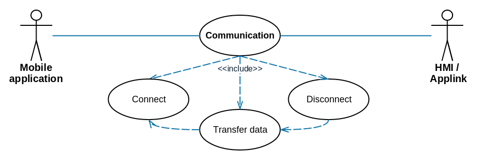

*Figure 1: Overview Use Case Diagram*

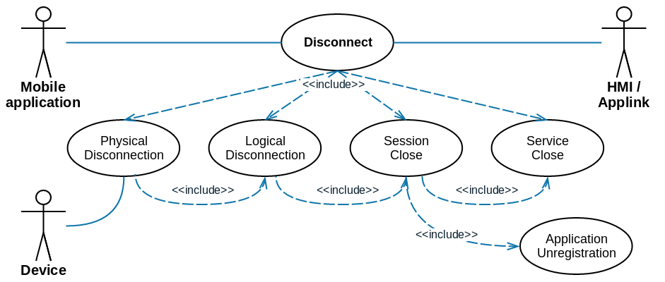 

*Figure 2: Disconnect Use Case diagram*

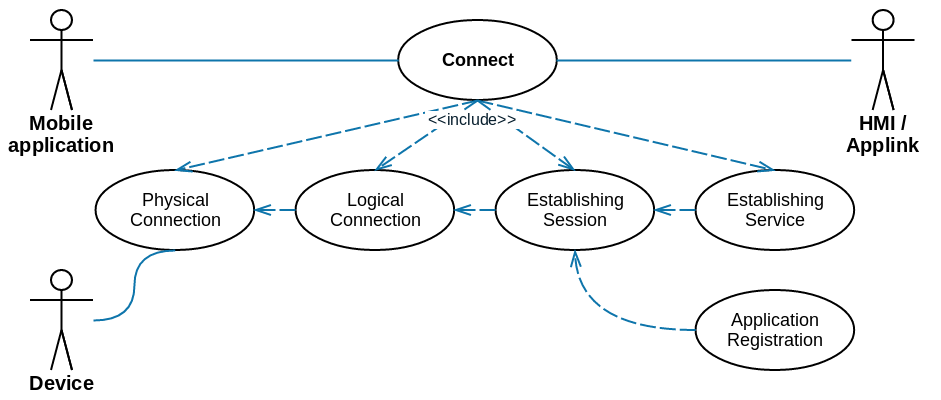 

*Figure 3: Connection Use Case diagram*

*Figure 4: Service data transferring Use Case diagram*

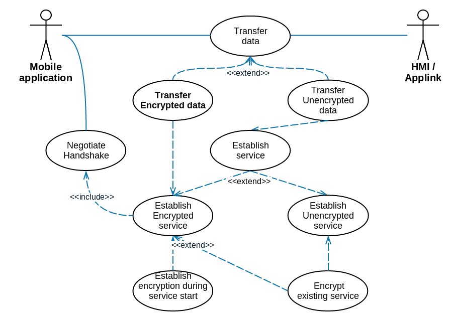 

*Figure 5: Encryption Use Case diagram*

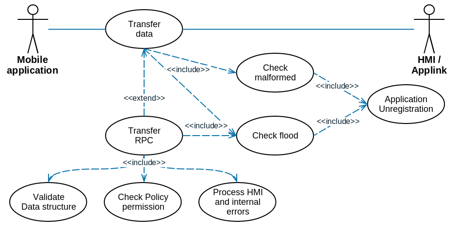 

*Figure 6: Data verification Use Case diagram*

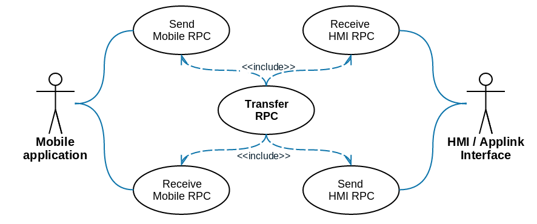
*Figure 7: RPC Use Case diagram*

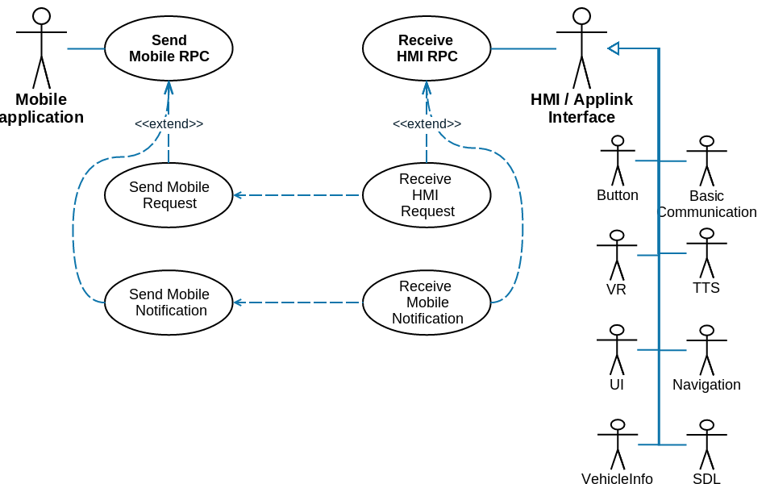

*Figure 8: Mobile to HMI RPC processing Use Case diagram*

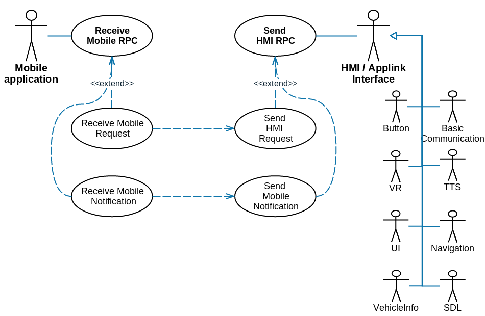 

*Figure 9: HMI to Mobile RPC  processing Use Case diagram*

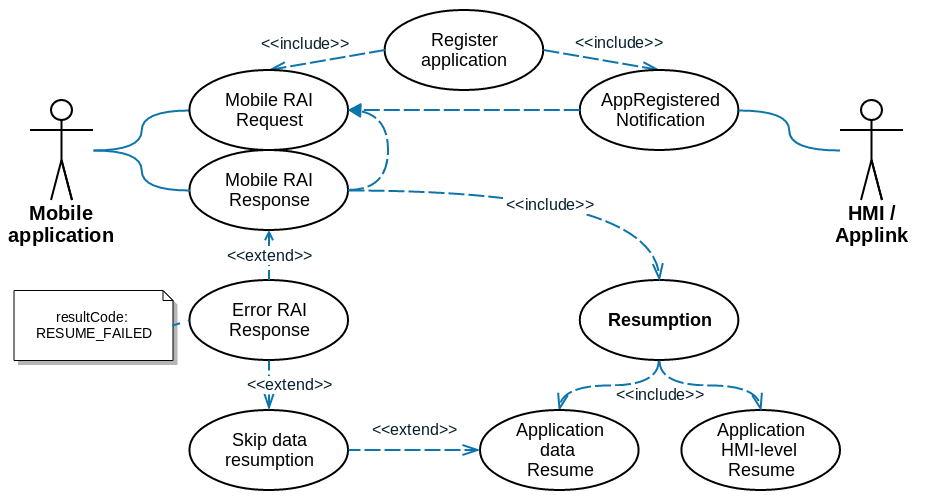

*Figure 10: Resumption Use Case diagram*

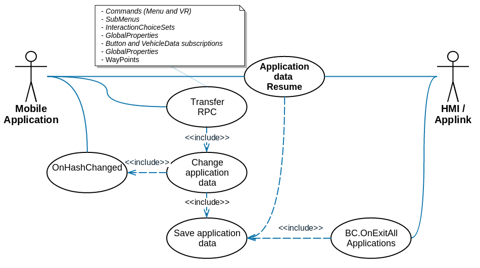

*Figure 11: Application data resumption Use Case diagram*

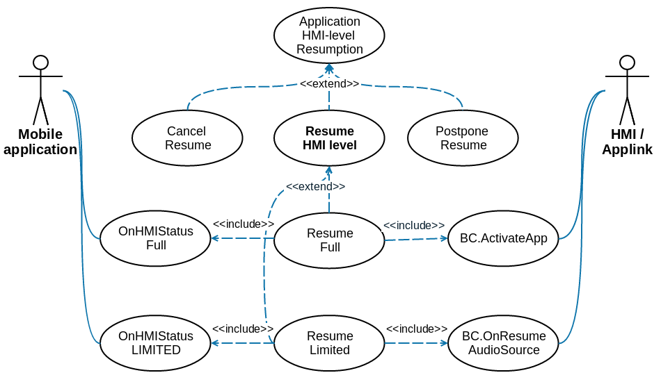

*Figure 12: HMI level resumption Use Case diagram*

2.2. Significant Driving Requirements
-------------------------------------

The requirements are listed in the table below and ordered by descending of their significance from architectural solution point of view.

| **\#** | **Driving Requirement Description**                                                                                                                                            |
|--------|--------------------------------------------------------------------------------------------------------------------------------------------------------------------------------|
| 1.     | System has to be POSIX-compliant to be easily ported on all POSIX standardized OSs.                                                                                            |
| 2.     | Transport for communication between Mobile Application and SDL system must be implemented and easily changed, replaced or added if required                                    |
| 3.     | APIs for communication between Mobile Application and SDL system described in appropriate documents have to be fully supported by the system.                                  |
| 4.     | There has to be relatively easy way to port existing HMI Modules (such as UI, VR, TTS, etc.) to work with SDL system.                                                          |
| 5.     | APIs for communication between SDL system and HMI Modules have to be fully described in appropriate document and fully supported by SDL system.                                |
| 6.     | HMI Module in order to communicate properly with SDL system has to follow rules specified in appropriate documents (i.e. mentioned above API describing document).             |
| 7.     | Mobile Application has to follow the rules specified in appropriate documents (i.e. mentioned above API describing document) in order to communicate with SDL system properly. |
| 8.     | Each request, provided by Mobile Application, is generated correctly - according to appropriate protocol standard,                                                             |

3.  Solution Overview
=====================

The picture below shows SmartDeviceLink technology overview.

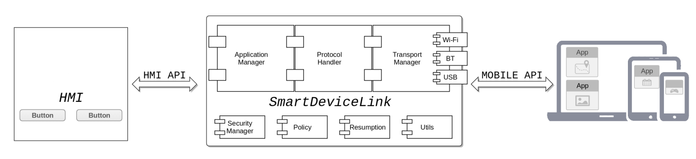

*Figure 13: Solution overview*

4.  Views
=========

4.1. Components View
--------------------

The view is represented by module and subsystem diagrams that show the system's export and import relationships. The Components View diagram and its elements description please see below.

*Note*: UML notation for this Components View diagram is extended: both component and it's interfaces are highlighted with the same colour. 

 

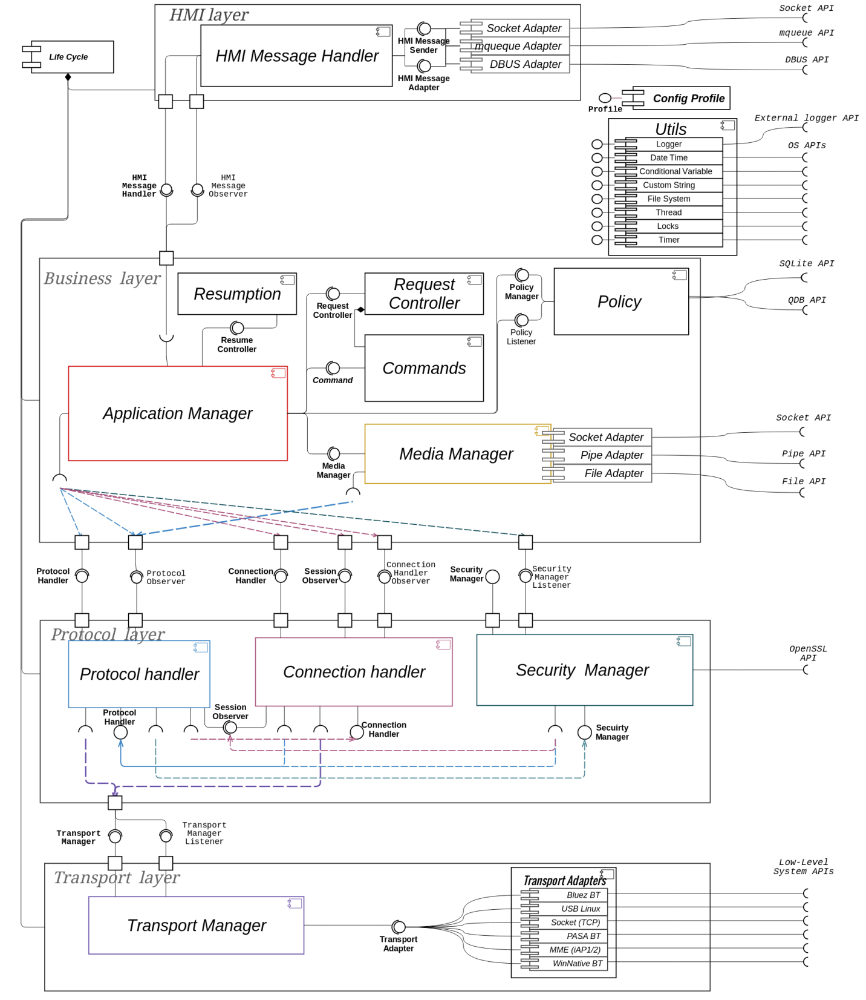

*Figure 14: Component View diagram*

                                                                                                                    
                                                                                                                                                                                              
 **Element Name and its Description** 
 
 Utility components:
 
***Life Cycle***  
 
- *Responsibility:*
  - Functional components manipulation 
    -   creation
    -   destruction                                                                                                
    -   initialization
    -   start, stop                                                                                                 
    -   binding                                                                                                 
  - System and Utils-specifics initialization                                                                                                
- *Relations*
  - Composes all available components

- *Interfaces*        
  -   Does not provide any external interfaces                                                                                                 
- *Behavior* 
  - ***Life Cycle*** creates all available in system components according configuration, binds components to components and starts each component internal routines.                                                                                                                 
- *Constraints*                                                                                                 
  - *N/A*                                                                                                              

***Config Profile***
  - *Responsibility*                                                                                                
    -    Storing information about application configuration.                                                                                    
  - *Relations*
    - Used by ***Life Cycle*** for filling other components ***Settings ***                                                                    
  - *Interfaces* 
    - Provides ***Profile*** interface                                                                                                         
  - *Behavior* 
    - ***Config Profile*** parses configurable data storage and provides primitive types by section and name of configurable value.                
                                                                
  - *Constraints* 
    - Configuration format - INI file.                                                                                                           
***Utils***
  - *Responsibility* 
    - Encapsulation system low-level functionality.                                                                                            
  - *Relations* 
    -   Used by all components.                                                                                                                  
  - *Interfaces* 
    - ***Logger*** macros-es and functions                                                                          
    - Data and Time
    - Files
    - ***Thread*** and ***Timer***
    - ***Locks*** and ***ConditionalVariable*** classes
    - ***CustomString*** class for UTF8 string handling                                                                                        
  - *Behavior*
    - ***Utils*** behavior relates to system-specific API.                                                                                        
  - *Constraints* 
    - *N/A*                                                                                                                                        
HMI layer components:

***HMI Message Handler***
  - *Responsibility*
    - Formatting message to and from unified protocol-API-independent format used by higher-level component.
    - Providing adapters for different transport types between SDL and HMI.                                                                    
  - *Relations*
    - ***Application Manager***
    - ***Utils***                                                                                                                              
  - *Interfaces* 
    - ***HMIMessageObserver*** interface for listening HMI messages notification
    - ***HMIMessageSender*** interface for sending Messages
    - ***HMIMessageAdapter*** interface for abstracting to-HMI transport
    - ***HMIMessageHandler*** interface for accumulating ***HMIMessageObserver, HMIMessageSender*** and ***HMIMessageAdapter***                
                                                                                                        
  - *Behavior*
    - Transferring RPC Messages between business-layer and configured transport.                                                                   
  - *Constraints* 
    - Processes messages from a single instance of HMI only.
    - HMI-transport need to be statically configurable with build flags.                                                                         |
Business layer components:

***Application Manager***
  - *Responsibility* 
    - Storing and providing mobile-related information
    - Mobile application state manipulation                                                                                                    
  - *Relations*
    - Uses ***Commands***
    - Uses ***MediaManager***
    - Requires ***HMIMessageObserver** and **HMIMessageSender (HMI Message Handler)***
    - Requires ***PolicyHandler** and **PolicyHandlerObserver (Policy)***
    - Requires ***ProtocolHandler** and **ProtocolObserver (Protocol Handler)***
    - Requires ***ConnectionHandler** and **ConnectionHandlerObserver (Connection Handler)***
    - Requires ***SessionObserver (Connection Handler)***
    - Requires ***SecurityManagerListener (Security Manager*** component***)***                                                                 
  - *Interfaces* 
    - Provides ***ApplicationManager*** interface
    
  - *Behavior*
    - The component implements business logic of the SDL.
    
  - *Constraints* 
    - *N/A*                                                                                                                                        
***Commands***
  - *Responsibility* 
    - Mobile and HMI RPC data verification according to business-requirements
    - Transferring Mobile RPC Requests to HMI subsystems (UI, VR, TTS and other available ones) and HMI to Mobile Responses and Notifications  
                                                                                                        
  - *Relations*
    - Created by ***ApplicationManager***
    - Composed by ***RequestController***
    
  - *Interfaces* 
    - Provides ***Command*** interface                                                                                                         
  - *Behavior* 
    - Mobile Requests are spitted between responsible HMI interfaces and sent as separate HMI Requests or Notifications.   
    - HMI Responses and notifications are verified according to business requirements and provided to Mobile                                       
  - *Constraints* 
    - *N/A*                                                                                                                                        
***Request Controller***
  - *Responsibility*
    - Pending requests handling
    - Optimization threads count for handling large quantity of pending RPCs                                                                   
  - *Relations* 
    - Composes ***Commands***
    - Composed by ***Application Manager***                                                                                                    
  - *Interfaces*
    - Provides ***Request Controller*** interface
    
  - *Behavior*
    - ***Request Controller*** handles timeout of responses and notifications from HMI.                                                            
  - *Constraints*                       
    - Configurable count of threads usage.                                                                                                       |
***Resumption***
  - *Responsibility*
    - Restoring application data
    - Storing application and HMI-related data between shutdown cycles                                                                         
  - *Relations*
    - Composed by ***Application Manager***                                                                                                    
  - *Interfaces*
    - Provides ***Resume Controller*** interface                                                                                               
  - *Behavior*
    - ***Resumption*** backs up application and HMI-related data and restores it after SDL start-up according to business logics.                  
                                                                                                    
  - *Constraints* 
    - *Configurable data storage type.*                                                                                                            
***Policy***
  - *Responsibility* 
    - Enabling advanced SDL functionality
    - SDL APIs protection from unauthorized application usage
    - Remotely manage SDL-enabled apps, including app-specific and device-specific access to system functionality
    - Maintain applications permissions on the system                                                                                          
  - *Relations*
    - Uses ***ApplicationManager*** interface for mobile application state manipulation                                                         
  - *Interfaces*
    - Provides ***PolicyManager*** interface for policy data manipulation
    - Provides ***PolicyListener*** interface for policy notification subscribing                                                              
  - *Behavior*
    - Receives data from Application manager
    - Parses data- Stores in local storage
    - Provides data via Application Manager to mobile device and HMI and vice-versa                                                               
  - *Constraints* 
    - Needs to be a switchable components: dynamically by configuration file and statically by SDL build define.                                |
***Media Manager***
  - *Responsibility*
    - Audio and Video data transferring to Media sub-system
    - Encapsulation binary data transferring transport                                                                                         
  - *Relations*
    - Used by ***Application Manager***                                                                                                        
  - *Interfaces*
    - Provides ***MediaManager*** interface
    
  - *Behavior*
    - Media Manager transfers raw Audio and Video data through one of the Media-adapters.                                                          
  - *Constraints*
    - Configurable Media-adapter usage                                                                                                          
Protocol layer components: 

***Protocol Handler***
  - *Responsibility*
    - Control and business data distributing to appropriate sessions and service
    - Control message processing
    - Multi-frames assembling and disassembling
    - Malformed packets determination and filtering                                                                                            
  - *Relations*
    - Notifies ***ConnectionHandler*** about connection and session state change
    - Uses ***SecurityManager*** for encryption and decryption payload data                                                                    
  - *Interfaces*
    - Provides ***ProtocolHandler*** interface for data sending and protocol layer manipulation
    - Provides ***ProtocolObserver*** notification for subscription on protocol events.                                                        
  - *Behavior*
    - Decodes income raw transport data and encodes outcome RPCs according to protocol specification.                                         
  - *Constraints*
    - *N/A*                                                                                                                                       
***Connection Handler***
  - *Responsibility*
    - Storing devices and connection information
    - Manage starting and ending of sessions
    - Providing device, connection and session information for protocol and business layer
    - Manipulation with devices, connections and sessions
    - Negotiation and monitoring the availability of device connections (heartbeat)                                                            
  - *Relations*
    - Requires ***ProtocolHandler*** for sending Control messages related to session life cycle
    - Requires ***TransportManager*** for forwarding business layer device and connection manipulations                                        
  - *Interfaces*
    - Provides ***ConnectionHandller*** interface for connection manipulation
    - Provides ***SessionObserver*** interface for session information manipulation                                                            
  - *Behavior*
    - Connection Handler works as a proxy from business-layer to transport layer and provides additional information related to protocol sessions and services.                                                                                                           
  - *Constraints*
    - *N/A*                                                                                                                                      
***Security Manager***
  - *Responsibility*
    - Data encryption and decryption
    - TLS Handshake negotiation
    - TLS Library dependency encapsulation                                                                                                     
 - *Relations*
   - Uses ***SessionObserver*** for setting Security information to sessions
   - Uses ***ProtocolHandler*** and ***ProtocolObserver*** for handling TLS handshake data                                                    
  - *Interfaces*
    - Provides ***SecurityManager*** interface for Security component
    - Provides ***SecurityManagerListener*** interface for notification handshake event
    - Provides ***SSLContext*** interface for data encryption and decryption                                                                   
  - *Behavior*
    - ***Security Manager*** provides methods to establish encrypted connection to mobile.                                                         
  - *Constraints* 
    - Needs to be a switchable components: dynamically by configuration file and statically by SDL build define.                              
Transport layer components:

***Transport Manager***
  - *Responsibility*
    - Manages low-level connections from Mobile Applications
    - Transport devices and connections manipulation
    - Performs device discovery
    - Sending and receiving mobile messages                                                                                                    
  - *Relations*
    - Composes ***TransportAdapters*** according to configuration
    
  - *Interfaces*
    - Provides ***TransportManager*** interface for devices and connections status manipulation
    - Provides ***TransportManagerListener*** interface for transport notification subscribing                                                 
  - *Behavior*
    - Accumulative class for all available in system devices and connections.                                                                     
  - *Constraints*
    - For Bluetooth transport there are only 32 connections available.                                                                           |
***Transport Adapter***
 - *Responsibility*
   - Transport-specific API encapsulation
  
  - *Relations*
    - Composed by ***TransportManager***                                                                                                       
  - *Interfaces*
    - Provides ***TransportAdapters*** interface                                                                                               
  - *Behavior*
    - Adopts transport searching, connecting, data transferring API for one ***TransportAdapters interface.***                                     
  - *Constraints*
    - *N/A*                                                                                                     

4.2. Component Interaction View
-------------------------------

According to layer architectural approach (see chapter 6.1), Component Interaction View could be split to Transport, Protocol and Business layer diagrams.

### 4.2.1. Transport layer

**Behavior**:

All device notifications are transferred through the Transport Adapter, accumulated by Transport Manger and provided for the upper levels with an unique device and connection identifier.

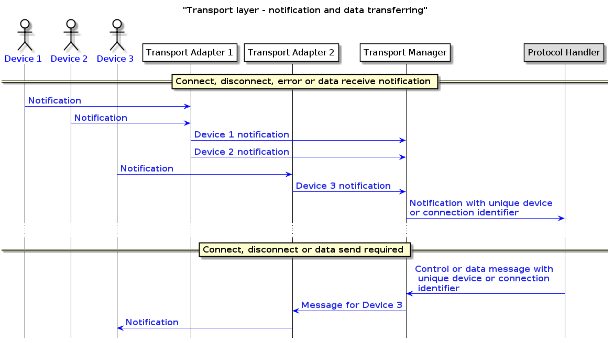

*Figure 15: Transport layer notification and data transferring diagram* 

### 4.2.2. Protocol layer

**Behavior**:

Protocol layer is responsible for transferring Transport and Protocol events to the Business layer.

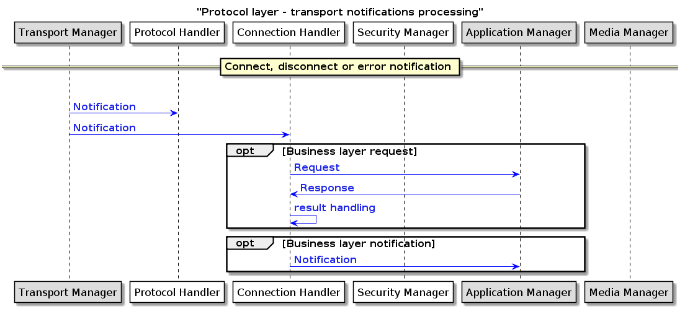

*Figure 16: Protocol Layer - transport notifications processing*

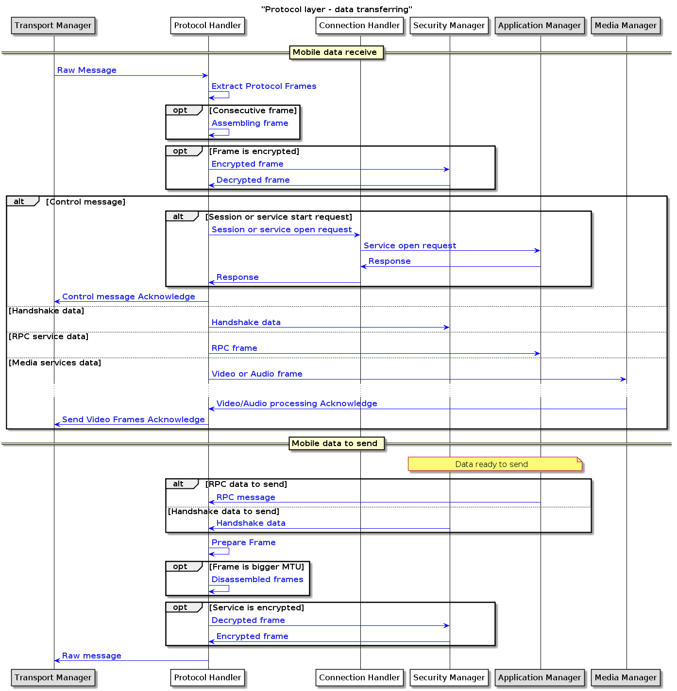

*Figure 17: Protocol Layer - data transferring diagram*

### 4.2.3. Business layer

**Behavior**:

Business layer is responsible for processing all income and outcome RPC data and media data streaming.

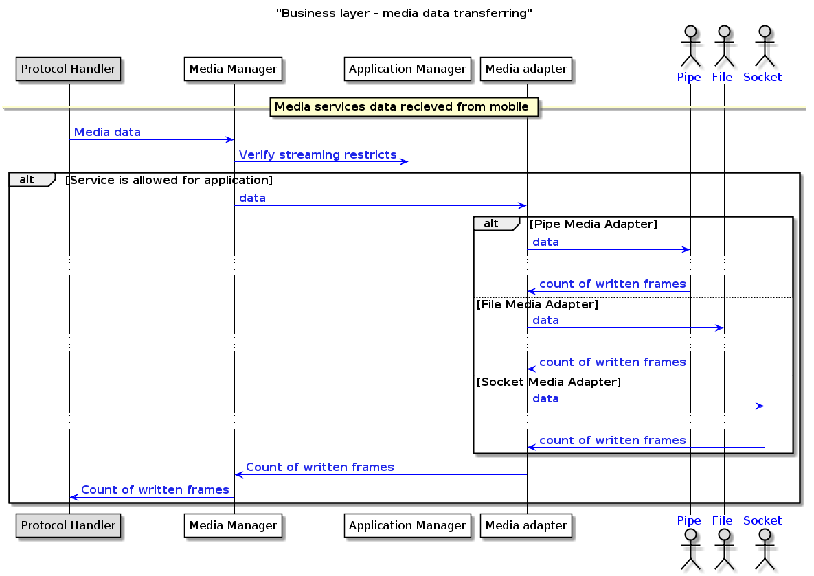

*Figure 18: Business layer - media data transferring*

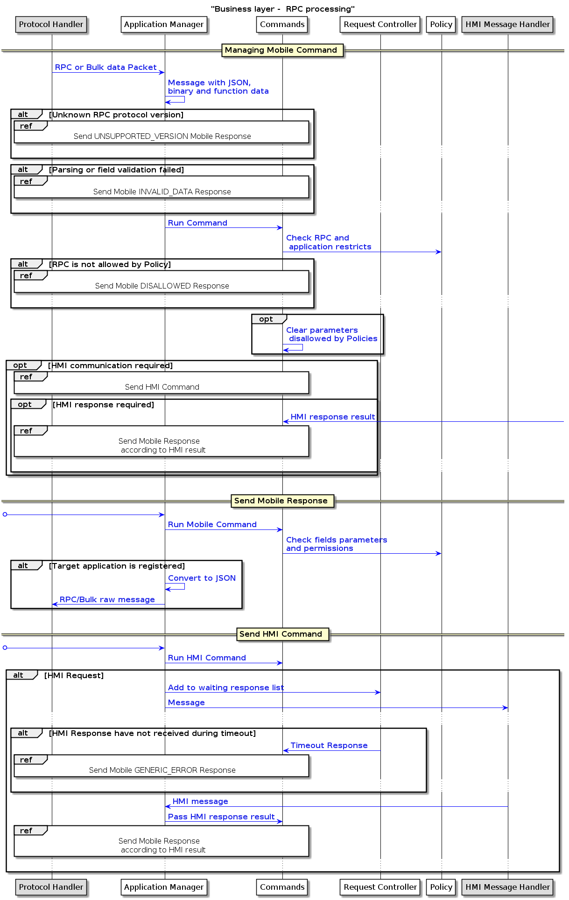

*Figure 19: Business layer - RPC processing diagram*

4.3. User Interface
-------------------

Not applicable, since the User Interface is not the part of development.

4.4. Data View
--------------

The Data View shows relations between separated data types and actors that perform information processing in the system. It depicts contents of saved information and also visualizes information sources, processors and destination.

The following Diagram shows relations between separated data types and actors that perform information processing in the SmartDeviceLink.

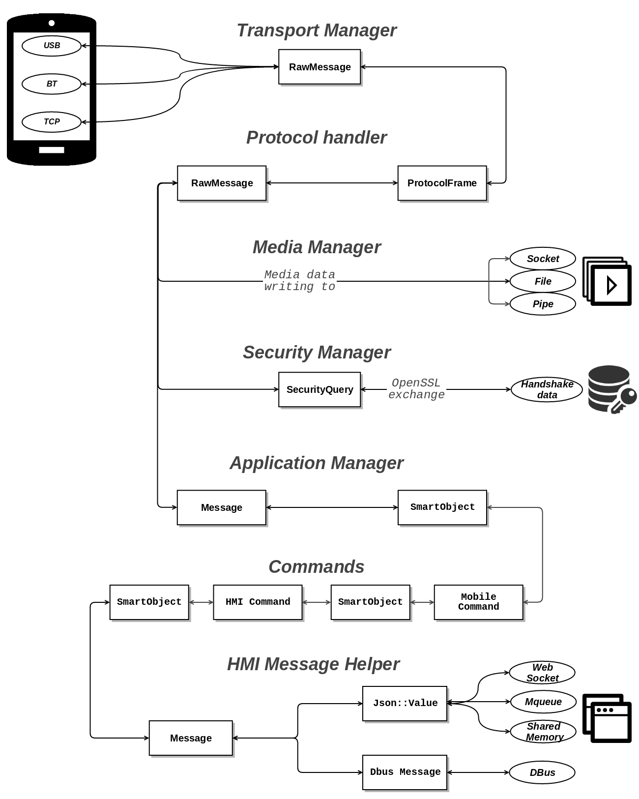 

*Figure 20: Data flow diagram*

**Element Name and its Description** 

***RawMessage***
  - *Summary:*
    - Stores raw data with connection identifier.                                                                          
  - *Usage:*
    - Data primitive in *Transport* *Manager*
    - Used by *Protocol* *Handler* as a transport layer income data, *connection\_key* identifies physical connection
    - Used by *Protocol* *Handler* as a business layer outcome data, *connection\_key* identifies unique session
     
***ProtocolFrame***
  - *Summary:*
    - Protocol layer primitive with protocol related information.                                                     
  - *Usage:*
    - Used internally by *Protocol* *Handler* for protocol header information prepossessing

***SecurityQuery***
  - *Summary:*
    - *Security* *Manager* primitive type.                                                                                 
  - *Usage:*
    - Encapsulates TLS handshake and security error data                                                            
    
***Message***
  - *Summary:*
    - Application Manager RPCs primitive type with function and correlation identifiers.                                   
  - *Usage:*
    - Internally by Protocol Handler for protocol header information prepossessing
    - As abstraction for *RPCs* transferring by *HMI* *Message Helper*                                              
    
***SmartObject***
  - *Summary:*
    - SmartObject acts as a union for business-layer data and could handle RPCs data as one hierarchy object.
    
  - *Usage:*
    - Used by *Application* *Manager*, *Commands* and *HMI* *Message Helper* for RPCs data filling
    - RPC's data transferring between business-layer components                                                        
    - *Note*: *SmartObjects* are being validated according to MOBILE\_API.xml and HMI\_API.xml.
    
***Mobile Command and HMI Command***
  - *Summary:*
    - RPCs objects with validation and processing data according to business requirements                                  
  - *Usage:*
    - *Application* *Manager* prepares *Mobile Requests according to SmartObjects *from transport layer
    - *Mobile Request* prepares *SmartObject* for the next *HMI Request* object and subscribes to answer event
    - *Application* *Manager* prepares *HMI Response according to SmartObjects from HMI layer*
    - *HMI Request* prepares *SmartObject* for the next *HMI Request* object
    
***JSON::Value***
  - *Summary:*
    - Json library abstraction                                                                                             
  - *Usage:*
    - Used as a primitive for JSON format in HMI transport
    
***DBUS message***
  - *Summary:*
    - DBUS message system abstraction                                                                                      
  - *Usage:*
    - Used as a primitive for DBUS format in HMI transport                                                           

4.5. Process State View
-----------------------

The process State view shows the global SmartDeviceLink states according to system life cycle.

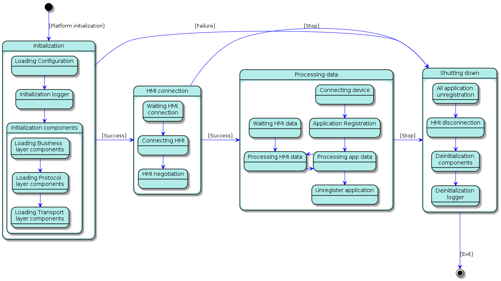

*Figure 21: Life cycle states diagram.*

**Element Name and its Description**

***Initialization***
  - *Behaviour:*
    - SDL creates and initializes component according to configuration file.                          
                                                    
  - *Relations:*
    - If all SDL subsystems successfully started, SDL starts waiting HMI and mobile connections.
    - If failed, SmartDeviceLink is ***shutting down***.                                              

***HMI connection***
  - *Behaviour:*
    - SDL waits for an HMI connection.                                                                
                                                                                        
  - *Relations:*
    - If HMI successfully connected, SDL starts ***processing*** all mobile ***data***.
    - On receiving stop signal SmartDeviceLink is ***shutting down***.
    
***Processing data***
  - *Behaviour:*
    - SDL handles HMI and mobile data and proceed according to business requirements.                 
                                                                        
  - *Relations:*
    - SDL starts shutdown procedure on getting stop signal from HMI or OS.
    
***Shutting down***
  - *Behaviour:*
    - SDL unregisters all mobile applications, disconnects from HMI and denitializes all components.  
                                                                                                
  - *Relations:*
    - Finish SDL life cycle.                                                                         

4.6. Process View
-----------------

Not applicable, since the developed system works within one process.

4.7. Development View
---------------------

### 4.7.1. Implementation Technologies

> C++98 language is selected as a programming language for SmartDeviceLink as a OS and CPU architecture independent.
>
> [*CMake*](https://cmake.org/documentation/) \[12\] tool-chain selected as a cross-platform building tools.
>
> [Google Test](https://github.com/google/googletest/blob/master/googletest/docs/Documentation.md) \[13\] with [Google Mock](https://github.com/google/googletest/blob/master/googlemock/docs/Documentation.md)\[14\] extension is chosen as an opensource C++ test framework.

###4.7.2. Modules and Code Base Organization

> Development view organizes SmartDeviceLink components into logical and abstract groups called layers. The layers describe the major tasks that the components perform. The layers have different responsibilities and different providers

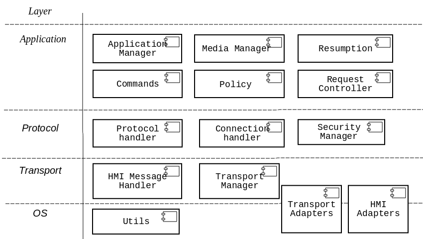 

*Figure 22: Development View Diagram*

**Element Name and its Description**

***OS Layer***
  - *Responsibility*
    - Providing high-level interface for OS and hardware resource manipulation.
    
  - *Relations:*
    - Used by all other layers                                                            

  - *Interfaces:*
    - Provides threads, timers, synchronization, data, time, file and logging interfaces  
 
  - *Behavior:*
    - Wrapping all OS-system-specific API to C++ Objects.                                 

  - *Constraints:*
    - N/A   
    
***Transport Layer***
  - *Responsibility*
    - Encapsulates mobile and HMI transports usage                                        

  - *Relations:*
    - Protocol layer                                                                      

  - *Interfaces:*
    - TransportManager
    - HMIMessageHandler                                                                   

  - *Behavior:*
    - Opens connection
    - Performs device discovery
    - Sends / receives messages                                                           

  - *Constraints:*
    - N/A   
    
***Protocol Layer***
  - *Responsibility:*
    - Encapsulates protocol manipulation.                                                 

  - *Relations:*
    - Application layer
    - Transport layer                                                                     

  - *Interfaces:*
    - ProtocolHandler
    - ConnectionHandler 
    - SecurityManager                                                                     
 
  - *Behavior:*
    - Parses and handles messages from transport layer according to Protocol 
    - Notify upper level about new transport and protocol layer events
    - Provides Transport Layer manipulation by upper layers                               

  - *Constraints:*
    - Depends on protocol specification version.
    
***Applicaton Layer***
  - *Responsibility:*
    - Represents main business logic implementation                                       

  - *Relations:*
    - Protocol Layer                                                                      

  - *Interfaces:*
    - ApplicationManager
    - MediaManager
    - Command
    - RequestController
    - Resumption
    - Policy
    
   - *Behavior:*
     - Main business logic functionality.                                                  

  - *Constraints:*
    - N/A                                                                                

### 4.7.3. Development Environment and Standards

-   Development and testing environment for Ubuntu 14.04 LTS x32/x64

    -   Debug Environment: Ubuntu 14.04 LTS x32/x64, Qt 5.3

    -   Compiler: GCC 4.9.3 (OS Ubuntu), Lua 5.2

    -   Build system: Cmake 2.8.12.2

-   Development and testing environment for SDL Windows x64:

    -   Build system: Windows 7 x64, CMake

    -   Compiler: Microsoft Visual Studio Express Edition 2013 x64

-   Development and testing environment for SDL Qt for Windows x32:

    -   Build system: Windows 7 x32, Qt 5.5, CMake, QT Creator

    -   Compiler: Microsoft Visual Studio Express Edition 2010 x32 

-   Requirements Management system: LuxProject (JIRA, Confluence)

-   Source Control System: GitHub

-   Issue Tracking System: LuxProject (JIRA)

-   Document Management System: LuxProject (JIRA, Confluence, SVN)

-   Coding style: [*Google C++ Style Guide*](https://google.github.io/styleguide/cppguide.html) \[15\]

4.8. Deployment View
--------------------

The deployment view takes into account the system's requirements such as system availability, reliability (fault tolerance), performance (throughput), and scalability. This view maps the various elements identified in the logical, process, and development views—networks, processes, tasks, and objects—onto the processing nodes.
The deployment diagram is used for modeling the static deployment view of a system.
The figure below depicts the deployment diagram for SDL system.

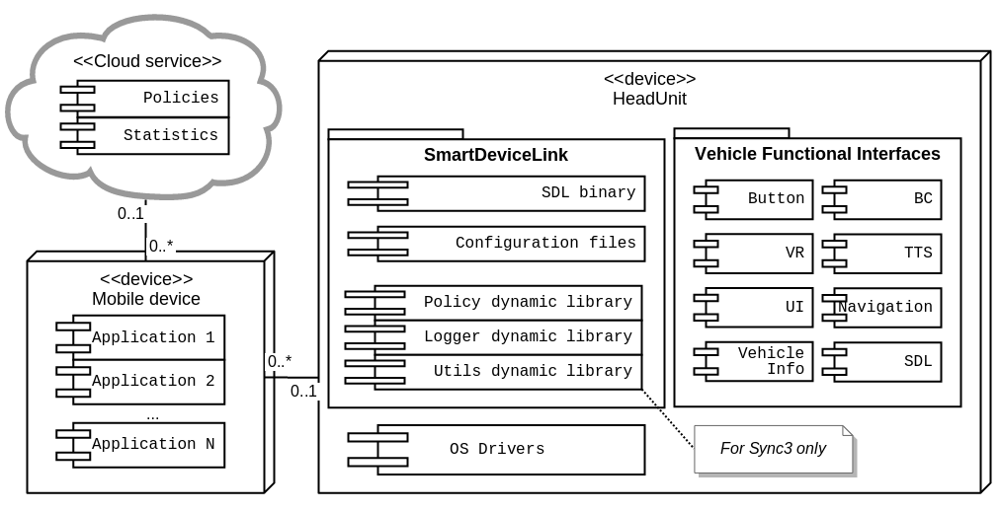

*Figure 23: Deployment View Diagram*

**Element Name  and its Description**

***Mobile Device***
  - *Short Description:*
    - The SDL application model permits multiple applications to be concurrently active and connected to the HU.
    - A few of those applications may interact with the user at a time using the HMI (depending on HMI). 
    - SDL uses the concept of HMI Levels to describe the current state of the application with regards to the level at which the head unit can communicate with it (and vice versa). 

  - *Relations:*
    - Receives policies updates from **Cloud Server**
    - Sends statistics to **Cloud Server**.                                                                                                                                            
  - *Requirements:*
    - Android OS or iOS.                                                                                                                                                              
***Head Unit***
  - *Short Description:*
  - HU HMI allows the user/driver to interact with the vehicle.
    - This interface includes:
    - A set of presets
    - Media buttons (seek forward/backward, tune up/down, and play/pause)
    - Menu items
    - Graphic user interface
    - Voice commands, etc.
  - The HU HMI Handler interfaces with SDL Core to support the API functionality.                                                                                                    
  - *Relations:*
    - Communicates with applications on **Mobile Device**
    
  - *Requirements:*
    - N/A                                                                                                                                                                             
***CloudServer***
  - *Short Description:*
    - A Server that provides information about:
      - Which applications are allowed to run in vehicle 
      - What interfaces application is allowed to use. 
    - In addition, server provides:
      - System configuration, including the time of the next file update
      - Some important server information to the back end user                                                                                                                         
  - *Relations:*
    - Sends policies updates to **Mobile Device**.
    - Receives statistics from **Mobile Device**.                                                                                                                                     
  - *Requirements:*
    - N/A                                                                                                           
    - 

4.9. Operational View
---------------------

This view describes how the architecture provides the ability for operation/support teams to monitor and manage the system. To make system more flexible and to support different platforms, SW provides a configuration and logging components, which are able to change system behavior according to settings defined in smartDeviceLink.ini file and to diagnostic 

**Element Name and is Description**
 
***Configuration***
  - *Config Profile* component specifies the desirable system behavior on different platforms and provides settings parameters for each functional component or functionality:
    - Mobile and HMI transports connection
    - Protocol, Connection, Security
    - Policy, Resumption
    - File system restrictions
    - Global properties like HelpPrompt, TimeoutPrompt, HelpTitle, HelpCommand
    - Default Timeout for mobile application commands
    - Desirable location of the system data (log files, persistence data, temporary data)                                                                                                                                                                                                                                                          
  - For further information with a list of all available parameters please refer to chapter "15.1 SDL’s configuration file structure" of [*smartDeviceLink .ini file*](https://github.com/smartdevicelink/sdl_core/blob/master/src/appMain/smartDeviceLink.ini).
  
***Diagnostics***
  - SmartDeviceLink system provides diagnostics messages log file with following types of messages:
    - ***FATAL*** message indicates abnormal problem related to external subsystems contract violation or SDL implementation issues. It indicates some critical issue and all SDL behaviors is undefined after this message.
    - ***ERROR*** message shows, that the problem occurred and SDL has not accomplished some internal or API activities. Error is successfully handled by SDL, but notifies about some business logic's flow breakdown. 
    - ***WARNING*** message warns against uncommon or rare flow. This message indicates handling some expected by SDL issue according to specified requirements.
    - ***INFO*** informs SDL user, integrators or support engineer about the component high-level activity success.
    - ***DEBUG*** and ***TRACE*** messages contain debug information for software engineer diagnostics and deep issues analysis.  
    

5.  View-to-View Relations
==========================

Each of the views specified in Section 3 provides a different perspective and design handle on a system, and each is valid and useful in its own right. Although the views give different system perspectives, they are not independent. Elements of one view will be related to elements of other views, and we need to reason about these relations.

5.1. Component-to-Layer
-----------------------

The following table is a mapping between the elements in the Component view and the Development view. The relationship shown is *is-implemented-by*, i.e. the layers from the Development view shown at the top of the table are implemented by any selected elements from the Component view, denoted by an "X" in the corresponding cell.

 ***Component*** / ***Layer***| **Application Layer** | **Protocol Layer** | **Transport Layer** | **OS Layer** |
|---------------------------|-----------------------|--------------------|---------------------|--------------|
| ***Life Cycle***          | X                     |                    |                     |              |
| ***Config Profile***      | X                     |                    |                     |              |
| ***Application Manager*** | X                     |                    |                     |              |
| ***Commands***            | X                     |                    |                     |              |
| ***Request Controller***  | X                     |                    |                     |              |
| ***Resumption***          | X                     |                    |                     |              |
| ***Policy***              | X                     |                    |                     |              |
| ***Media Manager***       | X                     |                    |                     |              |
| ***Protocol Handler***    |                       | X                  |                     |              |
| ***Connection Handler***  |                       | X                  |                     |              |
| ***Security Manager***    |                       | X                  |                     |              |
| ***HMI Message Handler*** |                       |                    | X                   | X            |
| ***Transport Manager***   |                       |                    | X                   |              |
| ***Transport Adapter***   |                       |                    | X                   | X            |
| ***Utils***               |                       |                    |                     | X            |

5.2. Data-to-Layer View
-----------------------

The following table is a mapping between the elements in the Data view and the Development view. The relationship shown is *is-implemented-by*, i.e. the layers from the Development view shown at the top of the table are implemented by any selected elements from the Component view, denoted by an "X" in the corresponding cell.

           
                        
 ***Data*** / ***Layer***| **Application Layer** | **Protocol Layer** | **Transport Layer** | **OS Layer** |
|-----------------------|-----------------------|--------------------|---------------------|--------------|
| ***Message***         | X                     |                    |                     |              |
| ***SmartObject***     | X                     |                    |                     |              |
| ***Mobile Command *** 
 ***HMI Command***      | X                     |                    |                     |              |
| ***ProtocolFrame***   |                       | X                  |                     |              |
| ***SecurityQuery***   |                       | X                  |                     |              |
| ***RawMessage***      |                       | X                  | X                   | X            |
| ***JSON::Value***     |                       |                    | X                   | X            |
| ***DBUS message***    |                       |                    | X                   | X            |

6.  Solution Background
=======================

6.1. Architecture Design Approach
---------------------------------

During the architecture designing the following aspects and rules were primary considered:

1.  **Three-layer architectural approach**: Transport (low), Protocol (middle), Application (high) layer.

    1.  Each layer component uses only own or low layer interfaces

    2.  Observer design pattern is required for providing information for upper layer components.

2.  **Weak components and classes coupling** for providing SmartDeviceLink Extensibility.

    1.  Providing each component and class functionality with an interface.

    2.  Facade design pattern is used for Mobile and HMI transports functionality within one interface.

    3.  Observer interface for providing information for upper layer components.

    4.  Binding different layers components is in LifeCycle component.asses

3.  **System scalability** for adding new interrogation platform transport. 

    1.  Adapter design pattern is used to provide permanent interface to transport layer.

    2.  Abstract Factory design pattern is used to create related objects without specifying their concrete classes directly.

    3.  Command design pattern is used to treat requests as an object that provides possibility to add new request without existing code modification.

4.  **OS and hardware abstraction **for simplifying portability to non-POSIX-compliant OS.

    1.  Adapter pattern is used for preparing the cross-platform interface for thread, timer, synchronization, file and data access functionality.

    2.  For HMI and Mobile transports used adapter pattern with a unified interface, which could be reused for new platform- and OS- specific transport API adoption

    3.  OS-related and 3d-party libraries APIs are segregated in Utils component, which available for all SDL layers 

    4.  Utils classes are implemented with Bridge design pattern (PIMPL idiom) for avoiding platform and 3d-party libraries dependencies. 

5.  **Asynchronous data and notification handling** for meeting real time restrictions on transport layer and providing vertical scalability.

    1.  Different data-types processing preferable in separate threads.

    2.  For internal data processing components preferable to use Utils::threads::MessageLoopThread for the same data objects processing

        1.  Asynchronous call result has to be provided with Observers interfaces to callee

    3.  For transport API adapters preferable the own Utils::threads::Thread implementation for meeting realtime restrictions

    4.  SmartDeviceLink logging implemented with Utils::threads::MessageLoopThread for avoiding console, file and other appends delay affect on functionality

    5.  For pending large number processing RPCs selected Controller design pattern with a limited and configurable count of processing threads

6.  **Resource Acquisition Is Initialization** (RAII, or *Scope-based Resource Management)* for memory, mutex, files and other resources managment.

    1.  utils::SharedPtr template class is implemented for memory deallocation.

    2.  utils::AutoLock is implemented for mutex acquiring and releasing 

    3.  utils::ScopeGuard is implemented for external memory and resource deinitialization.

7.  **Strict heap memory usage** for avoid memory leaks and memory corruption**.**

    1.  SmartDeviceLink objects aggregation is preferable by reference link storing instead of raw pointer,
        Note: in case external class life-time guaranty.

    2.  System objects composition is preferable by value or by smart pointer:

        1.  In case of exclusive object handling could std::auto\_ptr is preferable

        2.  For shared object handling utils::SharedPtr is preferable

6.2. Requirements Coverage
--------------------------

There are indirect requirements which may impact on Architectural decisions, such as limitation of usage of RAM, ROM, requirements to support specific SDL Core to HMI transport layers. All the requirements of this kind were taken into account while creating Architecture Design. 

-   [*SmartDeviceLink Protocol specification*](https://github.com/smartdevicelink/protocol_spec/blob/master/README.md) \[11\]

6.3. Prototyping Results
------------------------

Architecture prototyping was done to validate architecture on early stages. An evolutional prototyping technique was used. Thus all prototype components were used with non-significant changes and additional features for further development.

6.4. Open Questions and Known Issues
------------------------------------
None

6.5. Results Analysis
---------------------

Not applicable, since no quantitative or qualitative analysis was performed.

7.  References
==============
1. SmartDeviceLink Protocol specification - [*https://github.com/smartdevicelink/protocol\_spec/blob/master/README.md*](https://github.com/smartdevicelink/protocol_spec/blob/master/README.md)

2. Cmake documentation - <https://cmake.org/documentation/>

3. Google Test documentation - <https://github.com/google/googletest/blob/master/googletest/docs/Documentation.md>

4. Google Mock documention - <https://github.com/google/googletest/blob/master/googlemock/docs/Documentation.md>

5. Google C++ Style Guide - <https://google.github.io/styleguide/cppguide.html> 

8.  List of Figures
===================

1.  Overview Use Case diagram

2.  Disconnect Use Case diagram

3.  Connection Use Case diagram

4.  Service data transferring Use Case diagram

5.  Encryption Use Case diagram

6.  Data verification Use Case diagram

7.  RPC Use Case diagram

8.  Mobile to HMI RPC processing Use Case diagram

9.  HMI to Mobile RPC  processing Use Case diagram

10. Resumption Use Case diagram

11. Application data resumption Use Case diagram

12. HMI level resumption Use Case diagram

13. Solution overview

14. Component View diagram

15. Transport layer notification and data transferring diagram

16. Protocol Layer - transport notifications processing

17. Protocol Layer - data transferring diagram

18. Business layer - media data transferring

19. Business layer - RPC processing diagram

20. Data flow diagram

21. Llife cycle states diagram

22. Development View Diagram

23. Deployment View diagram

9.  Appendices                                                               
==============                                                                
None   
